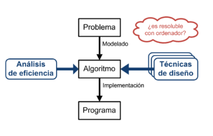

# Revisión de conceptos de programación

## ¿Qué es la programación?

* Es el proceso de codificar un algoritmo en el lenguaje de programación determinado, con el objetivo que sea ejecutado por la computadora.
* "La programación es una habilidad que se adquiere mejor con la práctica y el ejemplo más que con los libros" Alan Turing

## ¿Cómo se resuelve un problema?

1. Diseñar un algoritmo para el problema.
1. Expresar el algoritmo como un Programa (especificación formal de un algoritmo por medio de un lenguaje de programación)
1. Ejecutar el programa (Eficiencia + V&V)

## ¿Cuáles son las ramas de la programación?

* Desarrollo web
* Videojuegos
* Seguridad informàtica
* Desarrollo móvil
* Inteligencia artificial
* **Ciencia de datos**

## ¿Qué son los paradigmas de programación?

* Son los diferentes estilos de usar la programación para resolver un problema.
* Es un modelo que brinda principios y reglas que permiten abstraer la realidad.
* Guian el proceso de desarrollo de software.
* Orientan la forma de pensar.

* Tipos:
  * Operacionales (COMO)

    | | | |
    | -- | -- | -- |
    | **Imperativo** | secuencia, ciclos y condiciones. Mutación de variables | Fortran, C, Pascal, COBOL |
    | **Orientado a Objetos** | objetos que tiene datos y comportamiento y se comunican enviándose mensajes | Java, Python, Eiffel, Smalltack |

  * Declarativos (QUE)

    | | | |
    | -- | -- | -- |
    | **Funcional** | funciones que no manejan datos mutables o estados | Lisp, Haskell |
    | **Lógico** | reglas y hechos basados en la lógica de predicado | Prolog y dialectos |

## Python

### Características

* Es un **Lenguaje de Programación multiparadigma e interpretado**, creado por Guido Van Rossum (holandés) en 1991.
* Se trata de un lenguaje **fácil de aprender**, con una sintaxis muy sencilla que se asemeja bastante al pseudocódigo (alto nivel, cercano al lenguaje natural). En otras palabras, **poco código hace mucho**.
* Su uso **no está ligado a un sector concreto**. Es multipropósito.
* Tiene una **comunidad enorme**, además de gran cantidad de librerías.
* Es un lenguaje **multiplataforma**.
* Por lo general se puede hacer desarrollos en Python **más rápidamente** que en otros lenguajes, acortando la duración de los proyectos.
